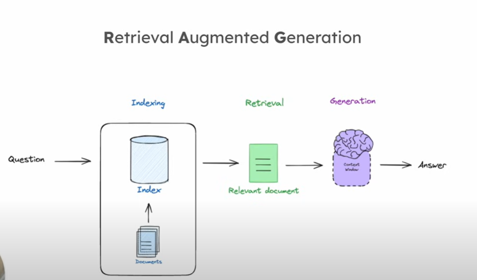

# RAG

RAG stands for **Retrieval-Augmented Generation**, a technique that enhances language models by retrieving relevant external information during the generation process. It combines two components:

1. **Retriever**: This part searches a large external dataset or document corpus to find relevant information based on a query or input.
2. **Generator**: This is usually a generative language model (like GPT), which takes both the input query and the retrieved information to generate a more informed and accurate response.

RAG is often used to improve the factual accuracy and relevance of generated text by leveraging external knowledge sources that may not be present in the language model’s internal training data. It is especially useful in open-domain question answering and tasks requiring up-to-date or domain-specific knowledge.