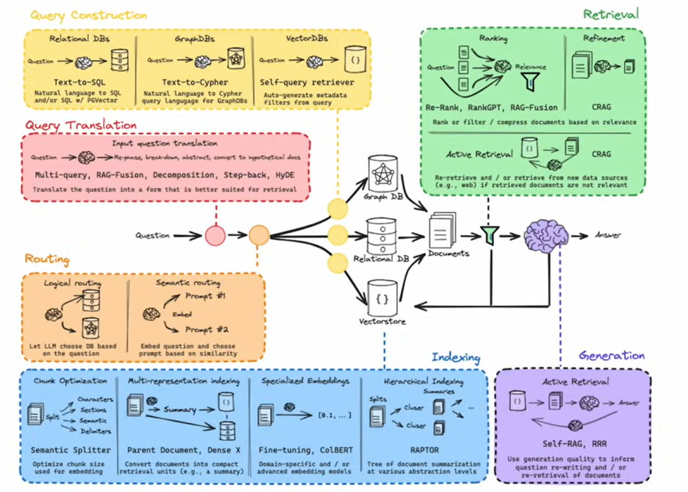
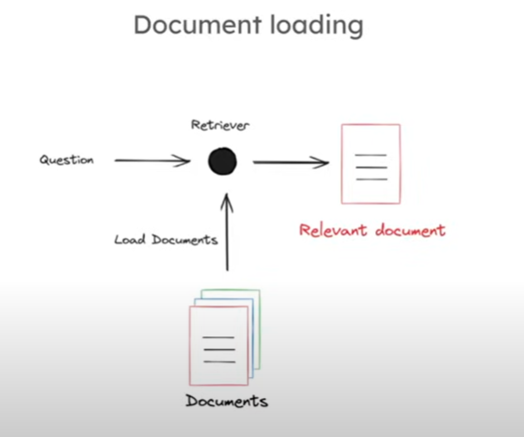
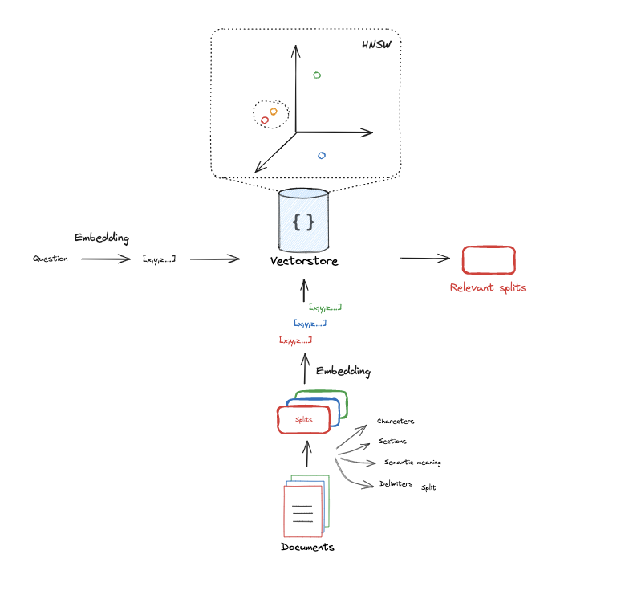

# RAG

RAG stands for **Retrieval-Augmented Generation**, a technique that enhances language models by retrieving relevant external information during the generation process. It combines two components:

1. **Retriever**: This part searches a large external dataset or document corpus to find relevant information based on a query or input.
2. **Generator**: This is usually a generative language model (like GPT), which takes both the input query and the retrieved information to generate a more informed and accurate response.

RAG is often used to improve the factual accuracy and relevance of generated text by leveraging external knowledge sources that may not be present in the language model’s internal training data. It is especially useful in open-domain question answering and tasks requiring up-to-date or domain-specific knowledge.

## Scope of learning

In **Retrieval-Augmented Generation (RAG)**, **query construction** refers to the process of creating a query from a given input (such as a user question or text prompt) to search an external knowledge base or document corpus for relevant information. The goal of query construction is to extract the most useful and relevant information that can be passed to the retrieval component of the system, which will then aid the generative model in producing a more informed and accurate response.

Here’s how query construction typically works in RAG:

### 1. **Input Processing**:
   The raw input (e.g., a question) is received, and the query construction system decides how to represent that input for retrieval. It may involve:
   - Tokenization: Splitting the input into smaller pieces (words, tokens, etc.).
   - Summarization or keyphrase extraction: Identifying the most important parts of the input.
   - Rewriting or refining the input: Adjusting the phrasing to improve retrieval results.

### 2. **Query Formulation**:
   Based on the processed input, a query is formulated. This query could take several forms:
   - **Direct Input**: The input itself might be used directly without changes.
   - **Condensed Query**: Only the key elements of the input are used in the query (e.g., extracting only nouns or key concepts).
   - **Contextualized Query**: The query may incorporate additional context from the input (e.g., surrounding text in a conversation).
   - **Multimodal Query**: If needed, other modalities (such as metadata or previous interactions) might be combined into the query.

### 3. **Query Expansion (Optional)**:
   Some RAG systems apply techniques to **expand** the query by adding synonyms, related terms, or other variations to increase the likelihood of retrieving relevant documents or data.

### 4. **Retrieval**:
   The constructed query is then passed to a retrieval system (such as Elasticsearch, FAISS, or a dense passage retriever) that searches the document corpus or knowledge base for relevant passages.

### 5. **Ranking & Selection**:
   The retrieved results are often ranked based on relevance, and the top results are selected to be fed into the generative model.

### Example:

For an input question like:  
**"What are the benefits of solar energy?"**

- The query could be directly **"What are the benefits of solar energy?"**.
- Or it could be condensed to focus on **"benefits solar energy"**.
- Additional query expansion might include synonyms like **"advantages of solar power"**.

In RAG, efficient and effective query construction is crucial to retrieve relevant, high-quality information, which directly impacts the quality of the final generated response.

## Active RAG

**Active RAG** refers to an enhancement of the traditional Retrieval-Augmented Generation (RAG) framework where the system actively refines or adjusts the retrieval process during the interaction with the user or across multiple steps of generation. It allows the model to iteratively improve the quality of the retrieval and generation by making the retrieval step more adaptive and context-aware.

Here's how **Active RAG** typically works:

### 1. **Iterative Query Refinement**:
   Instead of constructing a single static query for retrieval, Active RAG dynamically adjusts the query based on the generated response or additional context. The system might reformulate the query based on intermediate retrieval results or user feedback, improving relevance and accuracy over multiple steps.

### 2. **Feedback Loop**:
   Active RAG involves a feedback loop where the output of the generation process (i.e., the text generated by the language model) influences the next retrieval step. This iterative loop allows the system to continuously improve the results by focusing on areas where it lacks confidence or by requesting additional, more specific information.

### 3. **Context-Aware Retrieval**:
   Active RAG systems use the evolving context of a conversation or task to guide the retrieval. For instance, in a dialogue, Active RAG would adapt its queries and retrievals based on the conversation’s progression, pulling in new and more relevant information as needed.

### 4. **Exploration-Exploitation Trade-off**:
   Active RAG systems might employ exploration strategies to retrieve diverse pieces of information and then refine based on what proves useful, making the retrieval more efficient and the generation process more informative.

### Example Workflow:
1. **Initial Query**: A user asks, "What are the best practices for cloud security?"
   - The system retrieves documents related to cloud security based on an initial query.
   
2. **First Generation**: The model generates an answer from the retrieved documents.
   - If the generated response seems incomplete, the model can actively refine the query.

3. **Query Refinement**: Based on missing information or gaps in the response, Active RAG constructs a more specific follow-up query to retrieve deeper or more targeted knowledge about "data encryption in the cloud," for instance.

4. **Improved Generation**: The new set of documents improves the next round of generation, producing a more complete and accurate answer.

### Key Benefits of Active RAG:
- **Improved Answer Accuracy**: It corrects or adds to incomplete responses by actively retrieving more relevant information.
- **Contextual Awareness**: It adjusts its retrieval strategies based on the conversation or evolving input.
- **Iterative Improvement**: It provides a mechanism for refinement over multiple turns, resulting in more informed and nuanced responses.

Active RAG systems are particularly useful in complex tasks like customer support, technical troubleshooting, or research where the system needs to gather and synthesize information from various sources across multiple interaction steps.

## Indexing

**Indexing** is the process of organizing data in a structured way to make it easier and faster to retrieve relevant information during searches. In the context of databases, search engines, and information retrieval systems (like those used in Retrieval-Augmented Generation or RAG), indexing plays a crucial role by enabling efficient lookup and retrieval of relevant documents or data points based on queries.

### Key Concepts in Indexing:

1. **Data Structure for Indexing**:
   - Indexes are often built using data structures like **inverted indexes**, **B-trees**, or **hash tables**, depending on the type of data and search requirements.
   - An **inverted index** is a common structure where each term (word or token) points to a list of documents that contain that term, making it quick to find documents related to specific search terms.

2. **Indexing in Search Engines**:
   - When a document or dataset is indexed, a search engine breaks it down into smaller pieces (tokens) and creates an index that maps each token to the locations (documents, pages, or parts of text) where it appears.
   - For example, indexing a document with the text "solar energy benefits" would associate the words "solar," "energy," and "benefits" with the document. When a user queries "solar benefits," the search engine can quickly locate this document.

3. **Indexing in Databases**:
   - In databases, indexing helps speed up data retrieval by allowing the database to skip scanning the entire table when looking for specific records.
   - **Primary indexes** are based on the primary key of a table (unique identifier), while **secondary indexes** may be created on other fields to improve search performance for non-key fields.

4. **Indexing in RAG**:
   In **Retrieval-Augmented Generation**:
   - The knowledge base or document corpus used in RAG is indexed so that relevant pieces of information can be efficiently retrieved based on a query constructed by the model.
   - For example, if you're searching for "best practices in cloud security," the index will allow the retrieval engine to quickly find the relevant documents containing terms like "cloud," "security," and "best practices" without having to scan the entire dataset.

5. **How Indexing Works**:
   - **Document Tokenization**: The text or content in documents is split into individual tokens (words, phrases).
   - **Creating the Index**: Each token is stored along with references to the locations (documents) where it appears.
   - **Compression**: Indexes can be large, so techniques like compression are used to store them efficiently.
   - **Search and Retrieval**: When a query is made, the system searches the index to find relevant documents and then ranks and returns them based on relevance to the query.

### Types of Indexing:

1. **Full-Text Indexing**: 
   - All words from the text are indexed, except for stop words (common words like "the," "and," etc.).
   - Used in search engines to provide comprehensive document retrieval.

2. **Field-Based Indexing**:
   - Specific fields in structured data (like database columns) are indexed for fast lookups.
   - For example, indexing the "email" field in a database to allow quick searches by email address.

3. **Semantic or Vector Indexing** (Used in modern AI):
   - Instead of indexing words, embeddings (vector representations of words or sentences) are indexed. This allows semantic searches, where similar concepts can be found even if the exact terms are not used in the query.
   - Example: "Solar energy benefits" could retrieve documents related to "advantages of solar power" due to the similarity in meaning.

### Importance of Indexing:
- **Speed**: Indexing dramatically improves the speed of data retrieval, reducing the time complexity of searches.
- **Scalability**: As datasets grow, indexing ensures the system can still retrieve relevant results efficiently without scanning the entire corpus.
- **Relevance**: Indexing helps in filtering and ranking the most relevant documents based on the query.

### Example:
In a RAG system, if a user queries "Best practices for machine learning," the system doesn’t scan all documents from scratch. Instead, it looks up the index for relevant terms like "machine learning" and "best practices," retrieving only those documents that match, which are then passed to the generator for response creation.

Indexing is fundamental to the efficiency of search engines, databases, and AI systems that rely on large datasets or knowledge bases for quick, relevant information retrieval.